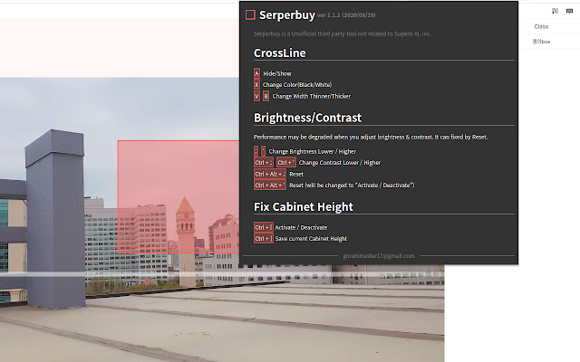
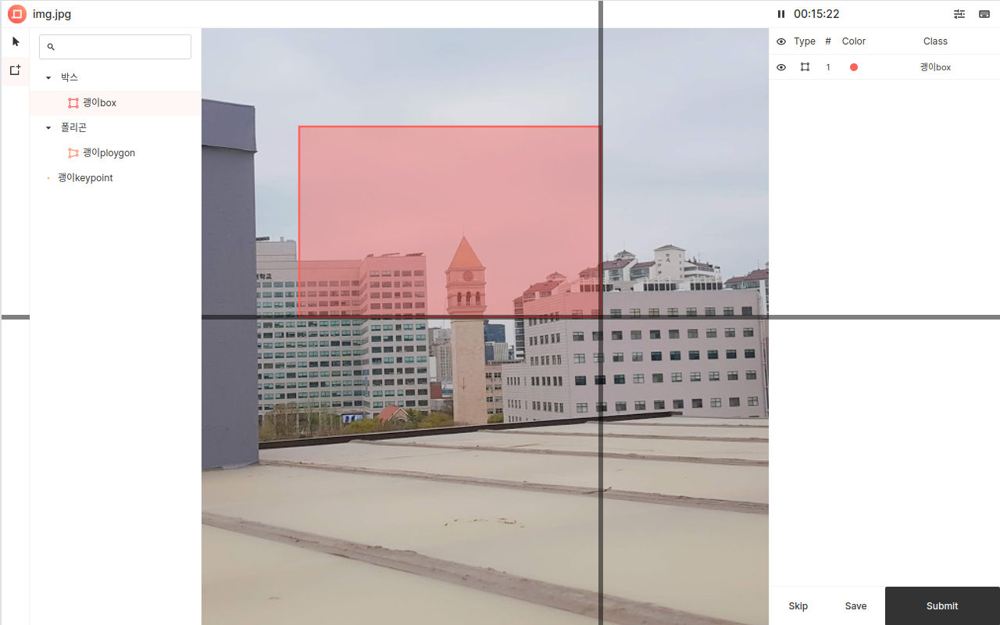
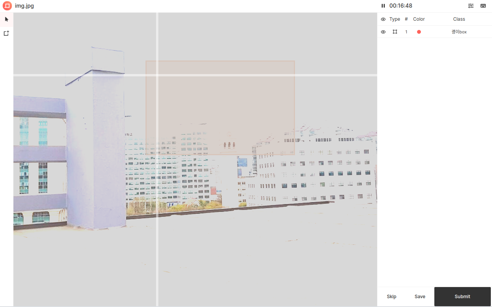
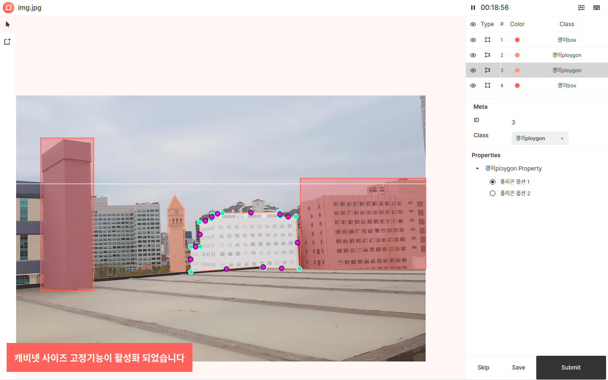

# serperbuy 1.x.x (for Legacy)

---

## Important Notice
[ABOUT LAST UPDATE]
* This extension is applied to SuperbAI Suite v1.9.9 and eariler (Legacy tools)
* This update is the last important update. There are no plans to add new features in the future. There will be a new Serperbuy running on the new SuperbAI Suite. I'll add a link here when it's released.

[마지막 업데이트에 대하여]
* 이 프로그램은 SuperbAI Suite v1.9.9 이하의 버전에서만 동작합니다. (기존의 레거시 툴) 
* 이번 업데이트가 마지막의 유의미한 업데이트입니다. 앞으로 새 기능이 추가될 계획은 없습니다. 새로운 SuperbAI Suite에서 동작하는 새 Serperbuy가 배포될 예정입니다. 배포되고 나면 여기에 링크를 추가하겠습니다.
* 그동안 사용해주셔서 감사합니다.

---

## User Guide
Cick this to watch the youtube video

---

## preview

---

## Detail Guide (ENG)
> Serperbuy is a Unofficial third party tool developed by the Superb AI Suite user. And it is not related to Superb AI, inc. 

##### Serperbuy
A chrome extension that provides convenience functions to Superb AI Suite.

##### What Serperbuy can do now
Now Serperbuy provides 3 modules for workapp
- CrossLine : Add crosshair to workapp ( that existed in the legacy workapp )
- Canvasif : Add brightness / contrast control to workapp ( that existed in the legacy workapp )
- FixCab : Add the function to save and fix the height of the right-side cabinet, to workapp

##### Support Info
- Image(New) project : Fully Supported
- Image(Legacy) project : NOT SUPPORTED
- Video project : partially Supported ( Only CrossLine, Canvasif, Not FixCab )

##### How to use
* CrossLine (crosshair)
    * A Hide/Show
    * X Change Color(Black/White)
    * V / B Change Width Thinner/Thicker

* Canvasif (Brightness/Contrast)
Performance may be degraded when you adjust brightness & contrast. It can fixed by Reset.
    * ; / '  Change Brightness Lower / Higher
    * Ctrl + ; Ctrl + '  Change Contrast Lower / Higher
    * Ctrl + Alt + ;  Reset
    * Ctrl + Alt + '  Activate / Deactivate

* FixCab(Fix Cabinet Height)
    * Ctrl + [  Activate / Deactivate
    * Ctrl + ]  Save current Cabinet Height

---

## Detail Guide (KOR)
> Serperbuy는 Superb AI Suite사용자가 개발한 서드파티 도구로, Superb AI, inc.와는 어떠한 관련도 없습니다.

##### Serperbuy 
Superb AI Suite에 편의기능을 추가해주는 구글 크롬 웹브라우저 확장프로그램입니다.

##### 현재 제공 기능 
현재 Serperbuy는 워크앱에 적용되는 세 가지의 모듈(기능)을 제공합니다.
* CrossLine : 기존 Workapp에 존재하던 십자선 기능을 새로운 Workapp에 추가합니다.
* Canvasif : 기존 Workapp에 존재하던 밝기/대비 조절기능을 새로운 Workapp에 추가합니다.
* FixCab : 우측 캐비넷의 높이를 저장/고정하는 기능을 새로운 Workapp에 추가합니다.

##### 지원 정보
* 새로운 Image 프로젝트 : 완전지원
* 기존 Image 프로젝트 : 전혀 지원하지 않음
* Video 프로젝트 : 부분지원 (CrossLine, Canvasif만 지원합니다. FixCab은 사용할 수 없습니다)

##### 사용법 
* CrossLine (십자선 기능)
    * A 보이기 / 숨기기
    * X 흑백 색상 토글
    * V/B 선 굵기 변경 (얇게/굵게)

* Canvasif (밝기/대비 조절기능)
밝기/대비가 조절된 상태에서 작업을 하면 성능저하가 나타날 수 있습니다. Reset하시면 해결됩니다.
    * ; / '  밝기 작게/크게
    * Ctrl + ; Ctrl + '   대비 작게/크게
    * Ctrl + Alt + ;  값 초기화
    * Ctrl + Alt + '  기능 활성화 / 비활성화

* FixCab(캐비넷 높이고정 기능)
    * Ctrl + [  기능 활성화 / 비활성화
    * Ctrl + ]  현재 캐비넷높이 저장

---

## Update Note
#### Eng.
1.1.4 (2021/09/27)
- This extension is applied to SuperbAI Suite v1.9.9 and eariler (Legacy tools). You can't use this on SuperbAI Suite v1.10.0 and later (New tools)
- This is the last update, and no further features will be added.

1.1.3 (2021/09/05)
- [Ctrl + Alt + '] works to activate/deactivate canvasif, not reset.

1.1.2 (2021/08/30)
- Fix uncaught errors and Critical bugs for FixCab

1.1.1 (2021/08/29)
- Now CrossLine supports saving user settings automatically.

#### Kor.
1.1.4 (2021/09/27)
- 이 프로그램은 SuperbAI Suite v1.9.9 이하의 버전에서만 동작합니다. (기존의 레거시 툴). 다시 말하면, 이 프로그램은 SuperbAI Suite v1.10.0 이상의 버전에서는 동작하지 않습니다. (새로운 툴)
- 이번 업데이트가 마지막 유의미한 업데이트입니다. 앞으로 새로운 기능을 추가할 계획은 없습니다.
- 새로운 SuperbAI Suite에서 동작하는 새로운 Serperbuy가 배포될 예정입니다. 배포완료되고 나면 여기에 링크가 추가될 예정입니다.

1.1.3 (2021/09/05)
- [Ctrl + Alt + ']가 Canvasif 값 리셋이 아닌 활성화/비활성화 키로 동작합니다.

1.1.2 (2021/08/30)
- 예기치 못한 에러들을 해결했습니다. FixCab이 갖고있던 치명적인 오류와 버그를 해결했습니다.

1.1.1 (2021/08/29)
- CrossLine의 사용자 설정값이 자동으로 저장됩니다.